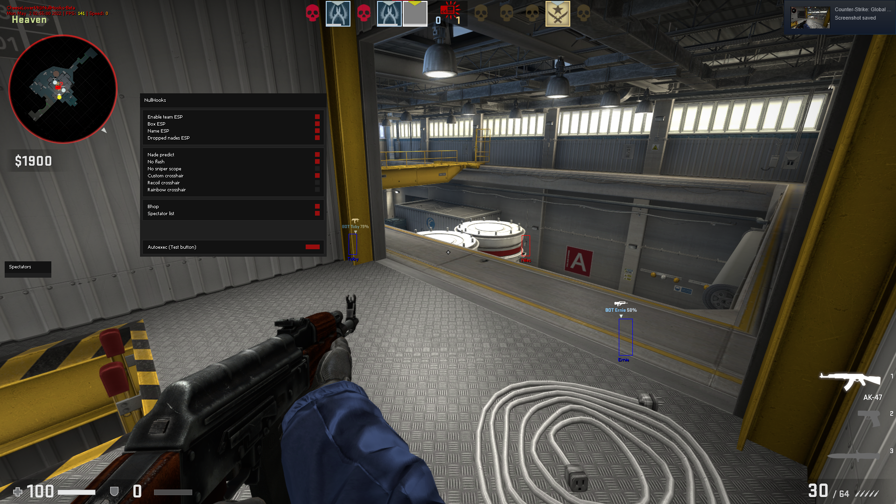
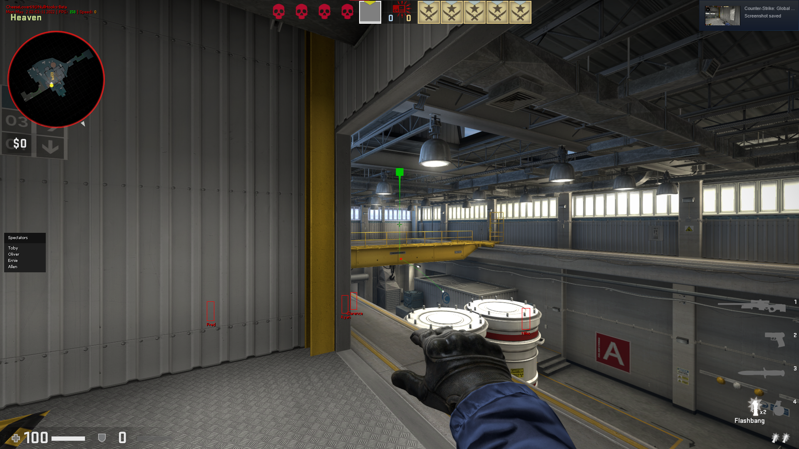

# NullHooks
**CS:GO cheat I made based on the famous base, and many other cheats I found.**

Based on: [Click me](REFERENCES.md)

## Features
#### Visuals - ESP
- Enable/disable team ESP
- Box ESP
- Name ESP
- Nade projectile ESP
<!-- 
- Health ESP
- Line
- C4 ESP
-->

#### Visuals - Others
- Grenade prediction
- No flash
- No scope
- Custom crosshair
- Recoil crosshair

#### Misc:
- BunnyHop
- Spectator list
- Stats watermark (*username, time, fps, speed...*)

## Todo:
- [X] Clean the code
- [X] Choose team not working (click)
- [X] Move *NullHooks-Lite* to *NullHooks* branches
- [X] Change spectator list style
- [X] Add recoil crosshair
- [X] Make spectator list movable (same as menu)
- [X] Add active nade ESP
	- [X] Fix smoke class id
- [X] Add nade prediction
- [ ] Add player skeleton ESP
- [ ] Bring menu tabs back (rip)
- [ ] Add chams
- [ ] Add bullet tracers
- [ ] Add C4 timer and ESP
- [ ] Fix both spectator list and menu dragging when overlapped (See bottom of `menu.cpp`)

## Screenshots
*Some screenshots might be a bit outdated...*  

