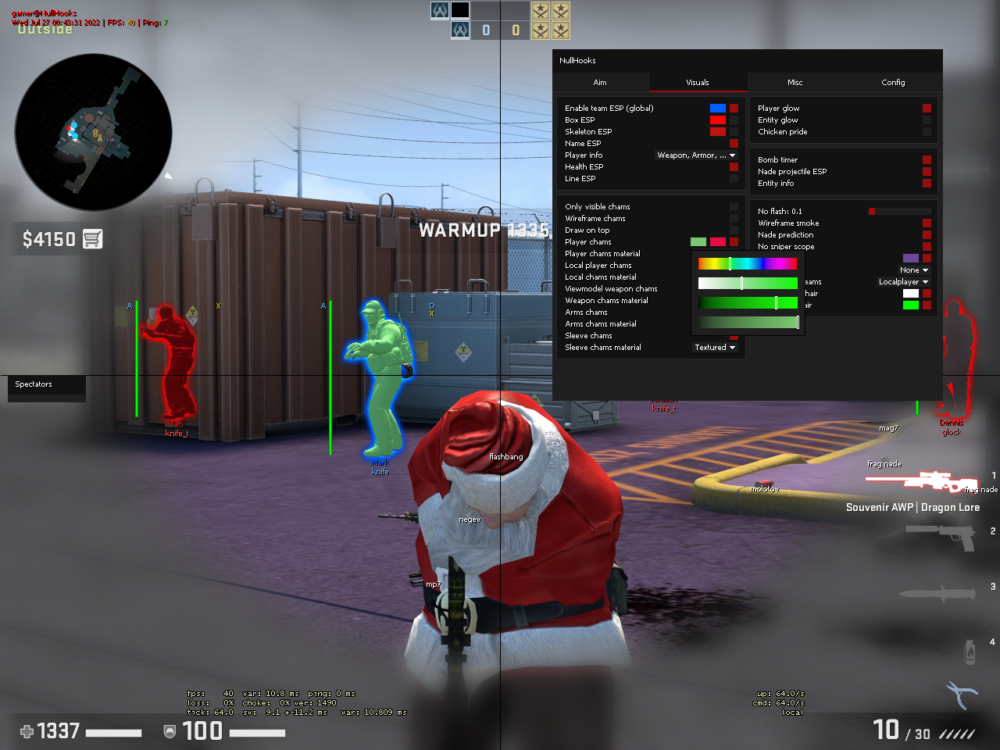
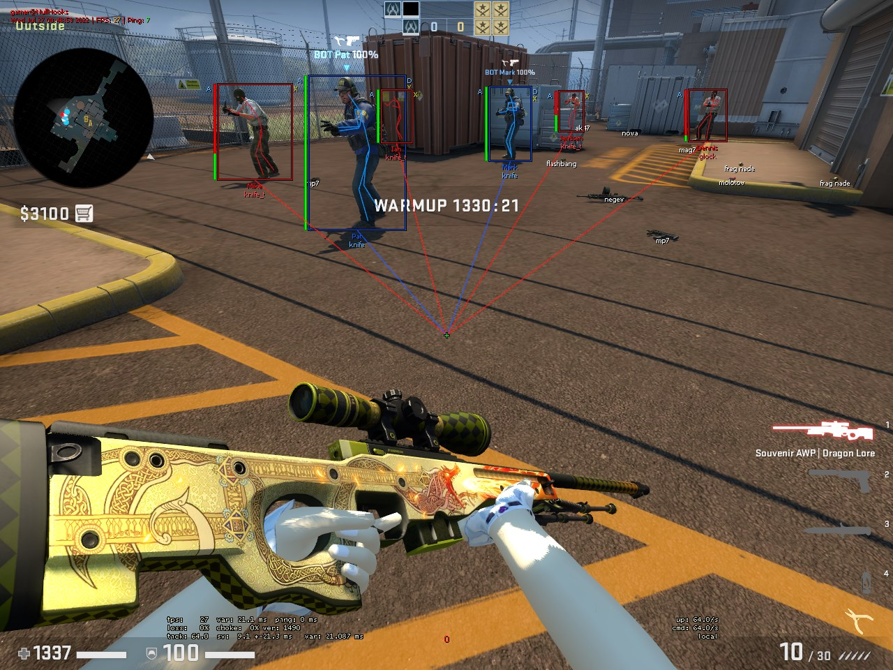
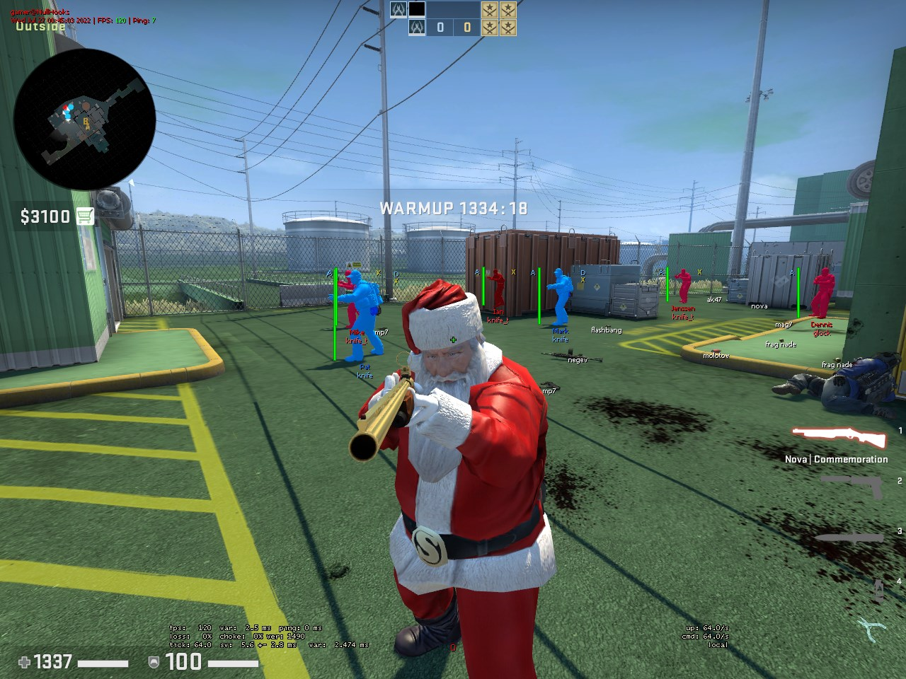
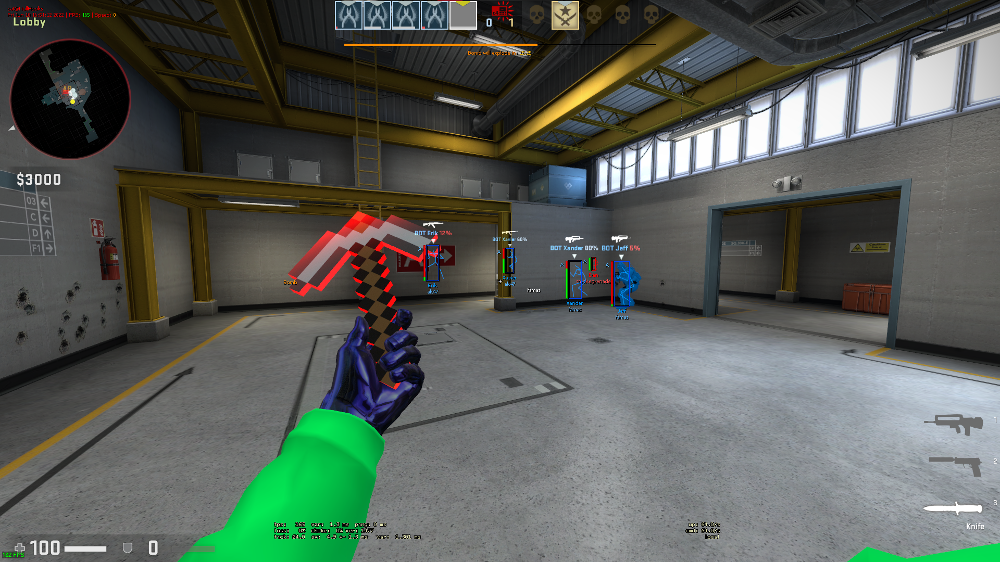
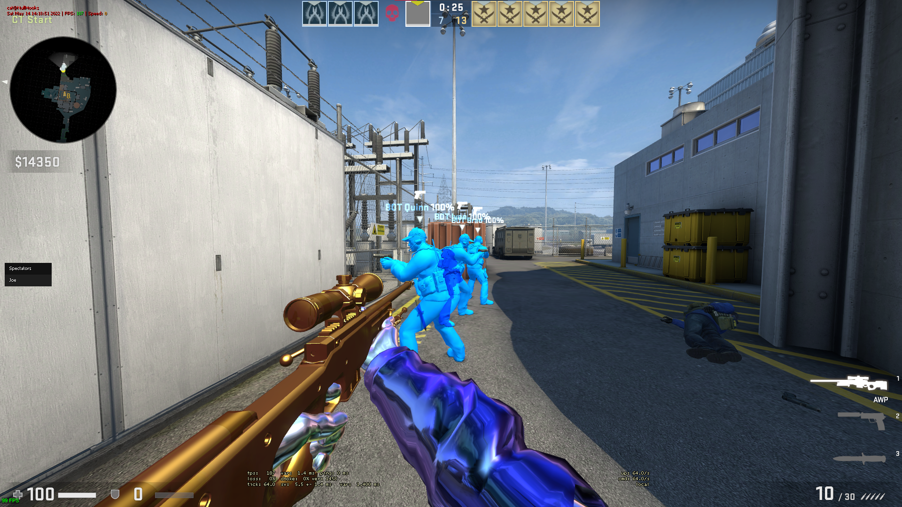

<div align="center">
    <h1>NullHooks</h1>
    <p><b>CS:GO cheat I made based on designer's base, and many other cheats I found. Mainly made for learning.</b></p>
    <div>
        <a href="https://github.com/r4v10l1/NullHooks/issues">
            
        </a>
        <a href="https://github.com/r4v10l1/NullHooks/pulls">
            
        </a>
        <a href="https://github.com/r4v10l1/NullHooks/blob/main/LICENSE">
            
        </a>
    </div>
</div>

# Table of contents
1. [Description](#description)
2. [Features](#features)
    - [Aim](#aim)
    - [Antiaim](#antiaim)
    - [Visuals](#visuals)
        - [Player ESP](#player-esp)
        - [Glow](#glow)
        - [Chams](#chams)
        - [Skinchanger](#skinchanger)
        - [Model changer](#model-changer)
        - [Misc](#misc)
    - [Movement](#movement)
    - [Misc](#misc-1)
    - [Config system](#config-system)
3. [Installing](#installing)
4. [Todo](#todo)
5. [Screenshots](#screenshots)

## Description
Edgy name but not as cool as *PissHooks™* (RIP).

As I said I made this project to learn about game hacking and cpp in general, so expect some bad practises and errors, but feel free to improve them!

See [contributing.md](CONTRIBUTING.md) for contributing to the project and [references.md](REFERENCES.md) for a list of cheats that helped me learn while making it.

*NOTE: If you are some kid from a third world country trying to sell this, please just don't, everyone knows how retarded you are.*

## Features
### Aim
- Triggerbot
    - With custom delay
- Aimbot
    - Snappy
    - Silent
- Autowall
    - Only visible
    - Autowall (Min damage)
    - Ignore walls
- Autofire
    - On key
    - Auto if key is set to 'None'
- Aimbot fov
    - Fov circle
- Aimbot smoothness (Only on snappy aimbot)
- Aimbot and triggerbot hitboxes
- Only if scoped
- Aimpunch only on rifles (Looks more legit)

### Antiaim
- Antiaim with custom pitch and jaw
- Spinbot with custom speed

### Visuals
#### Player ESP
- Enable/disable team ESP
- Box ESP
- Player skeleton
- Name ESP
- Health ESP
- Line
- Player info (flashed, weapons, etc.)
    - Current weapon
    - `A` - Armor
    - `F` - Is flashed
    - `S` - Is scoped
    - `X` - Can't shoot
    - `D` - Is defusing (soft)
    - `D` - Has defuser (hard)
    - `B` - Has bomb

#### Glow
- Player glow
- C4 glow
- Dropped weapons and grenades glow
- Chicken glow

#### Chams
- Player chams
- Hand chams
- Sleeve chams
- Weapon chams (viewmodel)
- Change individual materials for the chams

#### Skinchanger
The skinchanger loads a json file called `skins.json`, inside `DOCUMENTS/NullHooks/`, *DOCUMENTS* being your windows documents folder (will be created if it doesn't exist). The json structure is very simple, having the weapon buy index enum name as a string ([weapon name list](https://github.com/r4v10l1/NullHooks/blob/634ff18040739d0d7fe437074114f5eae92e907d/src/source-sdk/classes/entities.hpp#L193-L284)), with the weapon [properties](https://github.com/r4v10l1/NullHooks/blob/634ff18040739d0d7fe437074114f5eae92e907d/src/core/features/visuals/skin_changer/skin_changer.hpp#L34-L42) as strings inside:
Setting name                | Description
----------------------------|------------------------------------------------------------
`"item_definition_index"`   | Can have a weapon buy index as int or as enum name (Same names as weapons, like `WEAPON_KNIFE_M9_BAYONET` for example).
`"paint_kit"`               | The skin id as integer. You can find some skin ids [here](https://steamcommunity.com/sharedfiles/filedetails/?id=880595913) or [here](https://github.com/adamb70/CSGO-skin-ID-dumper/blob/master/item_index.txt)
`"seed"`                    | The skin seed as integer.
`"stattrack"`               | The stattrack kill number as int. `-1` means disabled. *:warning: Currently stattrack is not working properly becayse of an error. See todo list.*
`"quality"`                 | The int or enum string of the quality. List can be found [here](https://github.com/r4v10l1/NullHooks/blob/634ff18040739d0d7fe437074114f5eae92e907d/src/core/features/visuals/skin_changer/skin_changer.hpp#L19-L32).
`"wear"`                    | The float corresponding to the weapon wear. From `0.001f` to `1.f`, lower means better.
`"custom_name"`             | String containing the custom name for the weapon.

An example of a skin config file can be found in [example-configs/skins.json](https://github.com/r4v10l1/NullHooks/blob/main/config-examples/skins.json).

The skin chager currently is able to change:
- [X] Weapon skins
- [X] Knife skins and models
- [ ] Gloves

#### Model changer
There are currently 2 model changer methods. `find_mdl` and precached models. `sv_pure` bypass is integrated in the cheat.

The model changer is currently able to change:
- [X] Weapons
    - [X] Normal weapons
    - [X] Knifes
- [X] Players
    - [X] Localplayer
    - [X] Allies
    - [X] Enemies
- [X] Arms

:warning: All the models need to be downloaded manually.

- When using `find_mdl`, it will hook to the function, and when the game tries to load a model, we will replace it with our own. `find_mdl` model paths are hardcoded in [`models.hpp`](https://github.com/r4v10l1/NullHooks/blob/main/src/core/features/visuals/models.hpp). In that file explains where to put the models and all that. If an item is `NULL` it will be ignored.
- Precached models are a way better alternative, because with my json config system you can edit and load the file any time you want during a match. For adding models to a weapon, simply add to the skin json the following options:
    - `"viewmodel"`: The viewmodel path from the csgo directory. The viewmodel files usually start with `v_`.  
    *Example: `"models/weapons/eminem/bananabit/v_bananabit.mdl"`*
    - `"worldmodel"`: The worldmodel path from the csgo directory. The worldmodel files usually start with `w_`.  
    *Example: `"models/weapons/eminem/bananabit/w_bananabit.mdl"`*

A good example of a json file for replacing the knives usin precached models would be like this:
<details>
    <summary>Example skins.json file and explanation</summary>
    
```json
{
    	"LOCAL_PLAYER": "models/player/custom_player/kuristaja/hitler/hitler.mdl",
	"PLAYER_ALLY": "models/player/custom_player/kolka/master_chief/master_chief.mdl",
	"PLAYER_ENEMY": "models/player/custom_player/nier_2b/nier_2b.mdl",
	"ARMS": "models/player/custom_player/nier_2b/nier_2b_arms.mdl",

	"WEAPON_KNIFE": {
		"item_definition_index": "WEAPON_KNIFE_KARAMBIT"
	},
	"WEAPON_KNIFE_T": {
		"item_definition_index": "WEAPON_KNIFE_WIDOWMAKER"
	},
	"WEAPON_KNIFE_WIDOWMAKER": {
		"paint_kit": 416,
		"seed": 420,
		"quality": "SKIN_QUALITY_VINTAGE"
	},
	"WEAPON_BAYONET": {
		"paint_kit": 44,
		"seed": 555,
		"quality": "SKIN_QUALITY_CUSTOMIZED",
		"viewmodel": "models/weapons/caleon1/screwdriver/v_knife_screwdriver.mdl",
		"worldmodel": "models/weapons/caleon1/screwdriver/w_knife_screwdriver.mdl"
	},
	"WEAPON_KNIFE_KARAMBIT": {
		"paint_kit": 416,
		"seed": 69,
		"quality": "SKIN_QUALITY_GENUINE",
		"custom_name": "Banana knife",
		"viewmodel": "models/weapons/eminem/bananabit/v_bananabit.mdl",
		"worldmodel": "models/weapons/eminem/bananabit/w_bananabit.mdl"
	}
}
```

The first 3 lines are for changing special models. In this case ally players, enemy players and localplayer. See special models here: [Link](https://github.com/r4v10l1/NullHooks/blob/824b745d9fc17f139d6e6a223fa5533f52664e8c/src/source-sdk/classes/entities.hpp#L307-L312).

Changes the default ct knife index to the karambit one, automatically changing the models and applaying the skins of the karambit. Since there is a custom viewmodel and worlmodel, the model will change but the rarity, skin name, kill icon, etc. will be the same.

You can add viewmodels to weapons that you are not currently using like the bayonet in this case. Right now we are replacing the terrorist knife with a *Vintage Talon Knife Zaphire*, but if we wanted to change that, we could just edit the file, replace the `"item_definition_index"` of the terrorist knife to the `WEAPON_BAYONET`, load the skins config from the config tab and press the full update button.
</details>

#### Misc
- C4 timer and bar
- Dropped weapons and grenades name
- Nade projectile ESP
- Nade projectile duration
- Grenade prediction
- No flash
- No scope
- Wireframe smoke (Open an issue if you want NoSmoke)
- Worldcolor
- Custom crosshair
- Recoil crosshair
- Bullet tracers (:warning: Broken in online matches. Check [todo](#todo))
- Fov changer
- Thirdperson
- Motion blur

### Movement
- Infinite duck (:warning: Untrusted)
- BunnyHop
- Autostrafe
    - Legit
    - Rage
- Edgejump (On key)
- Edgebug assist (Needs improvement)
- Jumpbug (On key)
- Slow walk (On key)
- Speed graph (*With color, height and position options*)

### Misc
- Backtrack
- Spectator list
- Stats watermark (*username, time, fps, ping...*)
- Hide cheat on screenshots
- Hotkey system
    - <kbd>Delete</kbd> sets the hotkey to `None`, meaning that the hotkey will apear always as held
    - <kbd>Esc</kbd> will cancel the current hotkey selection, restoring it to its original state

### Config system
Config system for skins and settings (independent for now). The skin configs should be placed under the NullHooks folder which is created in your documents folder, and your setting configs should be placed under the config directory. Example:
```
DOCUMENTS
    └─ NullHooks
        ├─ config
        │   ├─ my_config_1.json
        │   └─ my_name_123.json
        └─ skins.json
```

For more information and examples check [`config-examples`](https://github.com/r4v10l1/NullHooks/tree/main/config-examples).

## Installing
### Compiling from source (Recommended)
I recommend using Visual Studio 2022.

1. Install Microsoft Visual Studio 2022 from [this link](https://visualstudio.microsoft.com/vs/community/)
2. [Clone](https://www.git-scm.com/docs/git-clone) or [download](https://github.com/r4v10l1/NullHooks/archive/refs/heads/main.zip) the project to your computer
3. Open the file `src/NullHooks.sln` with Visual Studio 2022
4. If an alert pops up, click `Ok` or `Update`, if it doesn't make sure the project is updated by clicking `Project > Retarget solution` in the window bar
5. Make sure you are compiling the project in `Release | x86` in the top bar
6. Click `Build > Build solution` in the window bar (You can also press `Ctrl+Shift+B`)
7. The final `.dll` file path should be in the output window of Visual Studio (Usually `src/output/release/NullHooks.dll`)
8. Inject using your favourite [injector](https://en.wikipedia.org/wiki/DLL_injection)

*Note: If you have problems, make sure you follow the steps above and verify the integrity of your game files.*

### Downloading the `.dll` from releases
This method is not recommended as the cheat can be a bit outdated and you might encounter some problems depending on your computer.

1. Go to the [latest release page](https://github.com/r4v10l1/NullHooks/releases/latest)
2. Download the file `NulHooks.dll` under "Assets"
3. Inject using your favourite [injector](https://en.wikipedia.org/wiki/DLL_injection)

## Todo
<details>
    <summary>Completed items</summary>  
    
- [X] Clean the code
- [X] Choose team not working (click)
- [X] Move *NullHooks-Lite* to *NullHooks* branches
- [X] Change spectator list style
- [X] Add recoil crosshair
- [X] Make spectator list movable (same as menu)
- [X] Add active nade ESP
    - [X] Fix smoke class id
- [X] Add nade prediction
- [X] Add player skeleton ESP
- [X] Bring menu tabs back (rip)
- [X] Make spectator list width dynamic depending on name lengths
- [X] Add line esp
- [X] Add glows 
    - [X] Add bomb glow
    - [X] Add player glow
    - [X] Add chicken glow
    - [X] Add weapon glow
- [X] Add bomb timer
- [X] Add weapon info about player
- [X] Fix entity names showing outside the map if they dont exist (See `entity_esp.cpp`)
- [X] Remove glow on nade projectiles
- [X] Remove esp on spectated player
- [X] Nade projectiles outside screen
- [X] Add option for disabling watermark and stats
- [X] Make gui checkboxes enable by clicking the name of the feature
- [X] Add chams
- [X] Add section columns
- [X] Add hand chams
- [X] Add material selector to chams
- [X] Support wchar strings in renderer (Russian characers for example, see comment in renderer) (See [this](http://cpp.sh/8dubg))
    - [X] Spectator list repeating name again (*const*'s fault?) <!-- 3c95dc7877eaad7ec734da2ab29606cd346fcea3 | interfaces::globals->max_clients -->
- [X] Fix chams on custom playermodels
- [X] Fix cursor position being relative to screen instead of game window
- [X] Add color picker ([example](screenshots/color-picker-edit.png))
    - [X] Add popup system that renders after the menu so other elements don't render over the window
    - [X] Fix `gui::id_changer()` decrease button. See [issue](https://github.com/r4v10l1/NullHooks/issues/5) 
    - [X] Add great global input system
- [X] Fix both spectator list and menu dragging when overlapped (See bottom of `menu.cpp`)
- [X] Add combobox (Will add multi-combobox when needed)
    - [X] Make selected item highlighted in the popup
- [X] Replace noflash toggle with slider for opacity
- [X] Add speedgraph
- [X] Fix combobox crash when holding outside area
- [X] Add second color picker
    - [X] Add color picker for friendly player chams
- [X] Fix chams render distance ([link](https://www.unknowncheats.me/forum/counterstrike-global-offensive/330483-disable-model-occulusion.html)) (#18)
- [X] Add custom models
    - [X] Check if model path exists ([link](https://www.unknowncheats.me/forum/counterstrike-global-offensive/141916-game-directory.html))
- [X] Add custom hotkeys to framework
- [X] Add motion blur (See [#25](https://github.com/r4v10l1/NullHooks/issues/25))
- [X] Add multicombobox
    - [X] For selecting what parts of the speedgraph we should draw
- [X] Reset bomb timer on new round (sometimes?)
- [X] Add <kbd>alt</kbd>+<kbd>tab</kbd> checks to global input
- [X] Add skinchanger
    - [X] Config based
- [X] Add config and all that (json or whatever)
    - [X] Skins
    - [X] Global config
- [X] Make config system more "nested"
- [X] Add can't shoot to player ESP
- [X] Add textbox to framework for creating new config files from menu
- [X] Add antiaim
- [X] Add killicons to knife skinchanger
- [X] Replace `player_info` esp with multicombobox
- [X] Replace `findmdl` model changer with precached models ([link](https://www.unknowncheats.me/forum/counterstrike-global-offensive/214919-precache-models.html))
- [X] Add "defusing" to bomb timer
- [X] Add worldcolor
- [X] Entity glow won't turn off on weapons (will turn off if another glow is on)
- [X] Skinchanger fixes
    - [X] Fix talon knife inspect animation
    - [X] Get localplayer steam id to fix weapon stattrack
#
</details>

- [X] Add aim stuff
    - [X] Triggerbot
        - [X] Add delay slider
    - [X] Aimbot
        - [X] Silent
        - [X] Snappy
    - [X] Aimbot fov circle (or square)
    - [X] Custom aimbot key (autofire)
    - [X] Add bodyaim if lethal
    - [ ] Make aimbot and triggerbot also aim for backtrack. (Get hitbox positions from matrix)
- [X] Add movement stuff
    - [X] EdgeJump
    - [ ] EdgeBug (Improve: [link](https://github.com/Spookycpp/millionware/blob/master/sdk/features/movement/movement.cpp#L119))
    - [X] JumpBug
    - [X] Slowwalk
    - [ ] Longjump
- [X] Add event listeners (hook `FireEventIntern`)
    - [X] Add bullet tracers
        - [ ] Fix `bullet_impact` event not working in online matches (without using event listener)
    - [ ] Add [decoy timer](https://www.unknowncheats.me/forum/counterstrike-global-offensive/498498-decoys-spawn-time.html)
- [ ] Add auto revolver hold
- [ ] Add player list <!-- Big flowhooks fan, sorry -->
	- [ ] Ability to set certain players to rage and ignore aimbot smoothing, etc.
	- [ ] Ability to set certain players to friendly and ignore aimbot, etc.
- [ ] Port to linux


## Screenshots
*Some screenshots might be a bit outdated...*  

<!-- Ignore the low fps in some of the screenshots, I had to tab out of the game to make them -->






