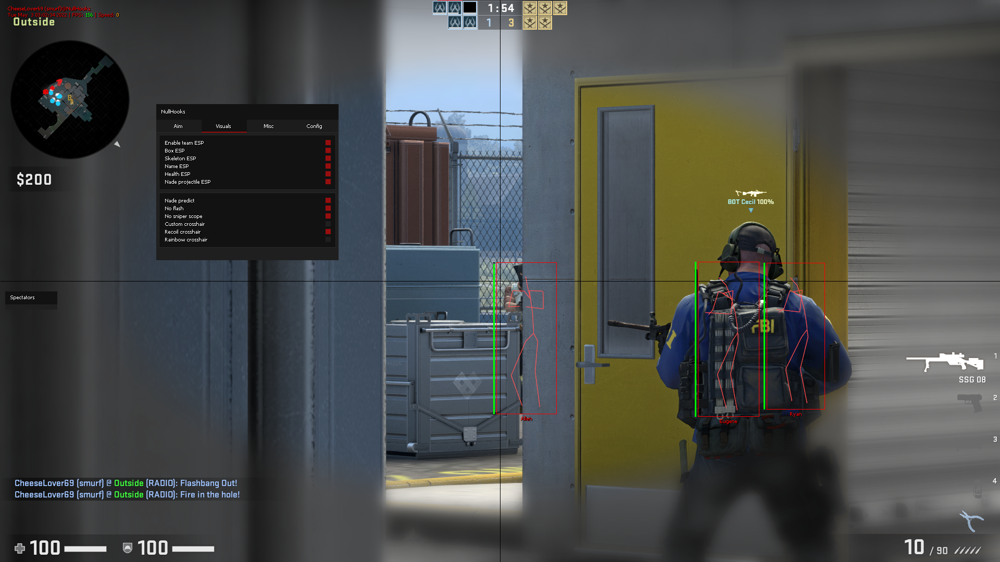
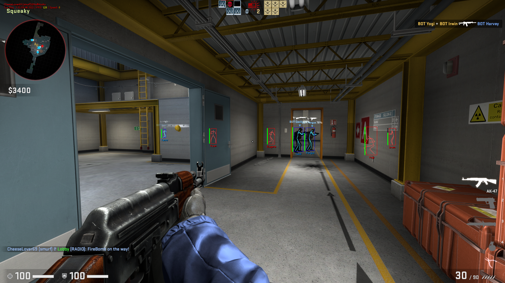
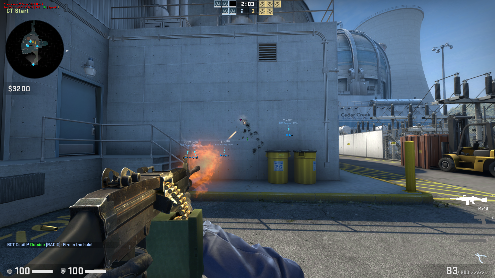

    <h1>NullHooks</h1>
    <b>CS:GO cheat I made based on designer's base, and many other cheats I found. Mainly made for learning.</b>
    

# Table of contents
1. [Description](#description)
2. [Features](#features)
    - [Visuals](#visuals)
        - [Player ESP](#player-esp)
        - [Glow](#glow)
        - [Chams](#chams)
        - [Misc](#misc)
    - [Misc](#misc-1)
3. [Installing](#installing)
4. [Todo](#todo)
5. [Screenshots](#screenshots)

## Description
Edgy name but not as cool as *PissHooks™* (RIP).

As I said I made this project to learn about game hacking and cpp in general, so expect some bad practises and errors, but feel free to improve them!

See [contributing.md](CONTRIBUTING.md) for contributing to the project and [references.md](REFERENCES.md) for a list of cheats that helped me learn while making it.

## Features
### Visuals
#### Player ESP
- Enable/disable team ESP
- Box ESP
- Player skeleton
- Name ESP
- Health ESP
- Line
- Player info (flashed, weapons, etc.)
    - Current weapon
    - `A` - Armor
    - `F` - Is flashed
    - `S` - Is scoped
    - `D` - Is defusing (soft)
    - `D` - Has defuser (hard)

#### Glow
- Player glow
- C4 glow
- Dropped weapons and grenades glow
- Chicken glow

#### Chams
- Player chams
- Hand chams
- Sleeve chams
- Weapon chams (viewmodel)
- Change individual materials for the chams

#### Misc
- C4 timer and bar
- Dropped weapons and grenades name
- Nade projectile ESP
- Nade projectile duration
- Grenade prediction
- No flash
- No scope
- Custom crosshair
- Recoil crosshair

### Misc
- BunnyHop
- Spectator list
- Fov changer
- Stats watermark (*username, time, fps, speed...*)

## Installing
### Compiling from source (Recommended)
I recommend using Visual Studio 2022.

1. Install Microsoft Visual Studio 2022 from [this link](https://visualstudio.microsoft.com/vs/community/)
2. [Clone](https://www.git-scm.com/docs/git-clone) or [download](https://github.com/r4v10l1/NullHooks/archive/refs/heads/main.zip) the project to your computer
3. Open the file `src/csgo-cheat.sln` with Visual Studio 2022
4. If an alert pops up, click `Ok` or `Update`, if it doesn't make sure the project is updated by clicking `Project > Retarget solution` in the window bar
5. Make sure you are compiling the project in `Release | x86` in the top bar
6. Click `Build > Build solution` in the window bar (You can also press `Ctrl+Shift+B`)
7. The final `.dll` file path should be in the output window of Visual Studio (Usually `src/output/release/csgo-cheat.dll`)
8. Inject using your favourite [injector](https://en.wikipedia.org/wiki/DLL_injection)

*Note: If you have problems, make sure you follow the steps above and verify the integrity of your game files.*

### Downloading the `.dll` from releases
This method is not recommended as the cheat can be a bit outdated and you might encounter some problems depending on your computer.

1. Go to the [latest release page](https://github.com/r4v10l1/NullHooks/releases/latest)
2. Download the file `csgo-cheat.dll` under "Assets"
3. Inject using your favourite [injector](https://en.wikipedia.org/wiki/DLL_injection)

## Todo

    
Completed items
  
    
- [X] Clean the code
- [X] Choose team not working (click)
- [X] Move *NullHooks-Lite* to *NullHooks* branches
- [X] Change spectator list style
- [X] Add recoil crosshair
- [X] Make spectator list movable (same as menu)
- [X] Add active nade ESP
    - [X] Fix smoke class id
- [X] Add nade prediction
- [X] Add player skeleton ESP
- [X] Bring menu tabs back (rip)
- [X] Make spectator list width dynamic depending on name lengths
- [X] Add line esp
- [X] Add glows 
    - [X] Add bomb glow
    - [X] Add player glow
    - [X] Add chicken glow
    - [X] Add weapon glow
- [X] Add bomb timer
- [X] Add weapon info about player
- [X] Fix entity names showing outside the map if they dont exist (See `entity_esp.cpp`)
- [X] Remove glow on nade projectiles
- [X] Remove esp on spectated player
- [X] Nade projectiles outside screen
- [X] Add option for disabling watermark and stats
- [X] Make gui checkboxes enable by clicking the name of the feature
- [X] Add chams
- [X] Add section columns
- [X] Add hand chams
- [X] Add material selector to chams
- [X] Support wchar strings in renderer (Russian characers for example, see comment in renderer) (See [this](http://cpp.sh/8dubg))
    - [X] Spectator list repeating name again (*const*'s fault?) <!-- 3c95dc7877eaad7ec734da2ab29606cd346fcea3 | interfaces::globals->max_clients -->

- [ ] Add color picker ([example](screenshots/color-picker-edit.png))
    - [X] Add popup system that renders after the menu so other elements don't render over the window
    - [ ] Fix `gui::id_changer()` decrease button. See [issue](https://github.com/r4v10l1/NullHooks/issues/5)
- [ ] Fix chams on custom playermodels
- [ ] Make a lot of settings variables static
- [ ] Add chicken chams <!-- Rainbow? -->
- [ ] Add custom radar with renderer, why not
- [ ] Add "defusing" to bomb timer
- [ ] Reset bomb timer on new round (sometimes?)
- [ ] Add aim stuff
- [ ] Add event listeners (or `FireEvent` hook, etc.)
    - [ ] Add bullet tracers
    - [ ] Add [decoy timer](https://www.unknowncheats.me/forum/counterstrike-global-offensive/498498-decoys-spawn-time.html)
- [ ] Add config and all that (json or whatever)
- [ ] Entity glow won't turn off on weapons (will turn off if another glow is on)
- [ ] Fix both spectator list and menu dragging when overlapped (See bottom of `menu.cpp`)

## Screenshots
*Some screenshots might be a bit outdated...*  

