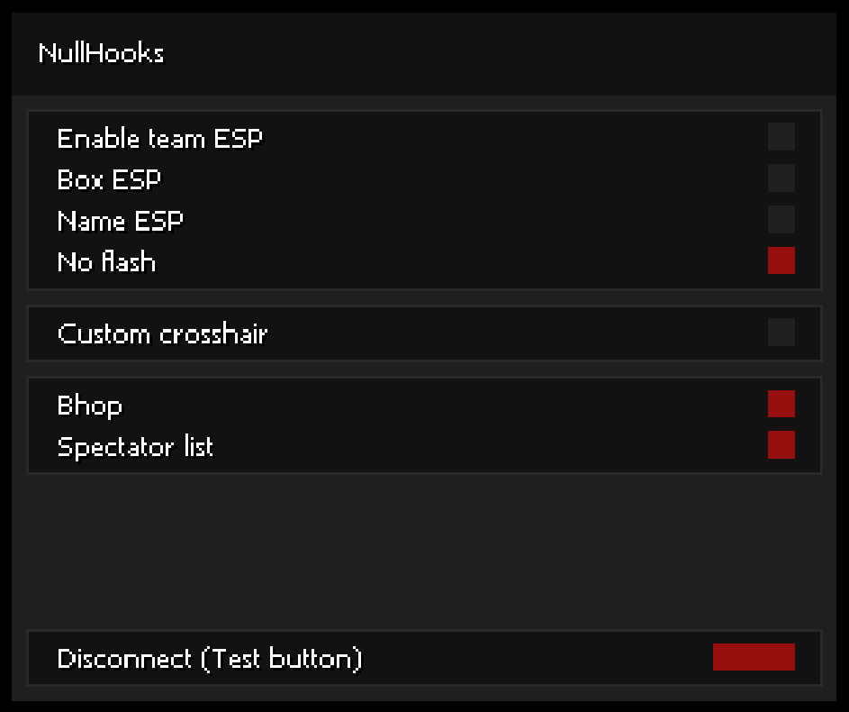

# NullHooks
**CS:GO cheat I made based on the famous base, and many other cheats I found.**

Based on: [Click me](REFERENCES.md)

## Features
#### Visuals - ESP
- Enable/disable team ESP
- Box ESP
- Name ESP
<!-- 
- Health ESP
- Line
- C4 ESP
-->

#### Visuals - Others
- No flash
- No scope
- Custom crosshair

#### Misc:
- BunnyHop
- Spectator list
- Stats watermark (*username, time, fps, speed...*)

## Todo:
- [X] Clean the code
- [X] Choose team not working (click)
- [X] Move *NullHooks-Lite* to *NullHooks* branches
- [ ] Change spectator list style
- [ ] Make spectator list movable (same as menu)

## Screenshots
*Some screenshots might be a bit outdated...*  

